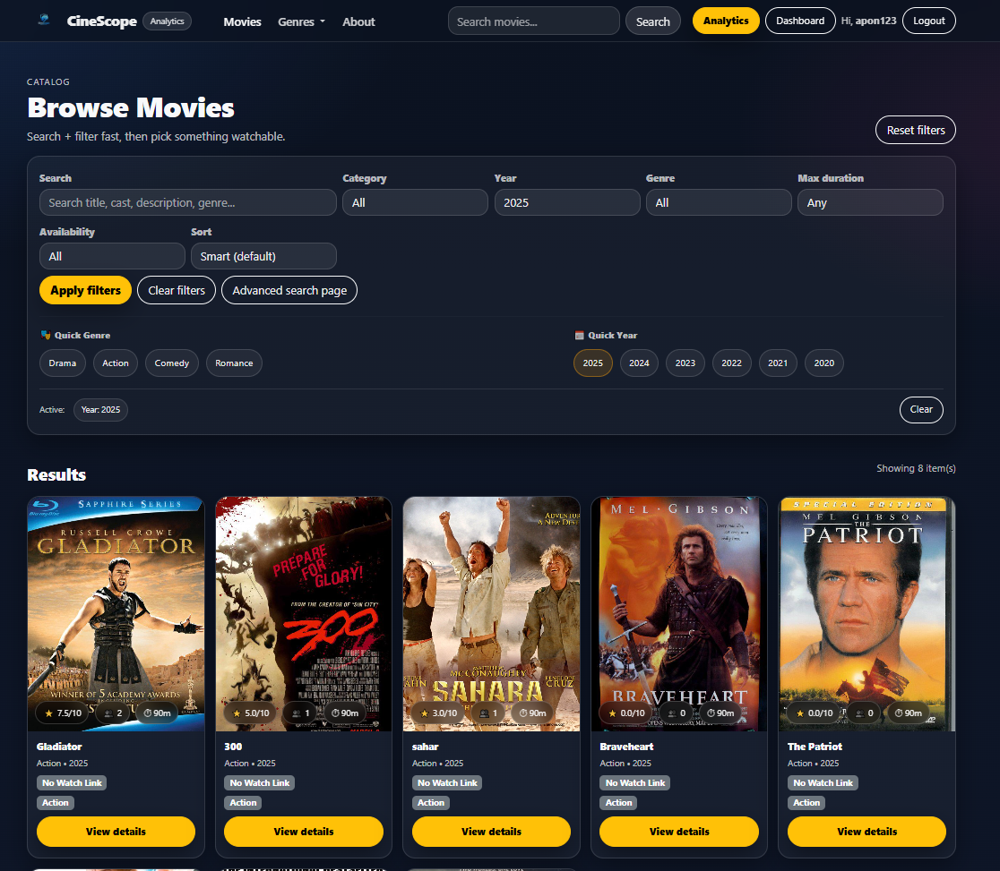
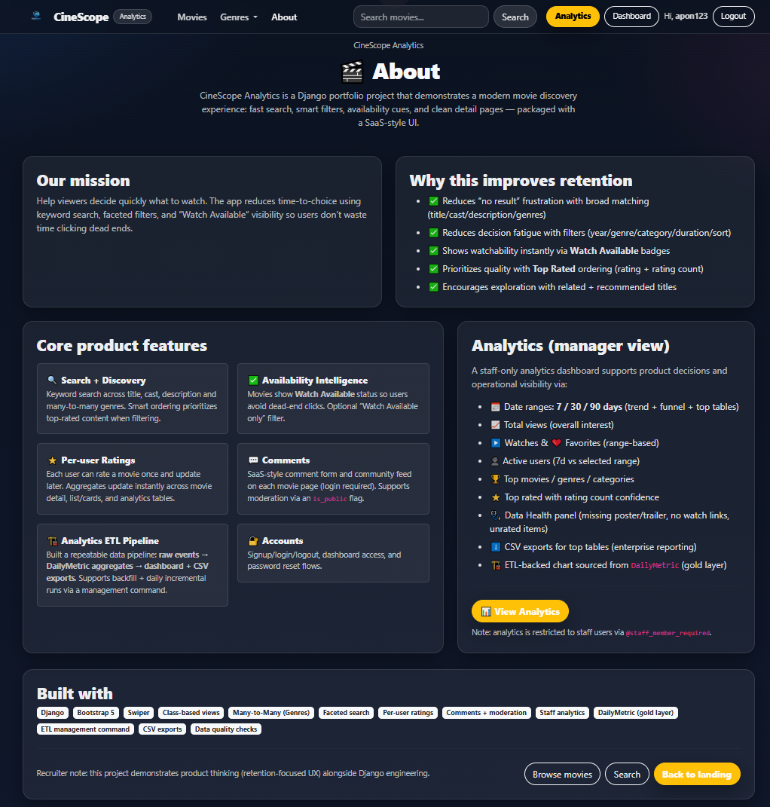
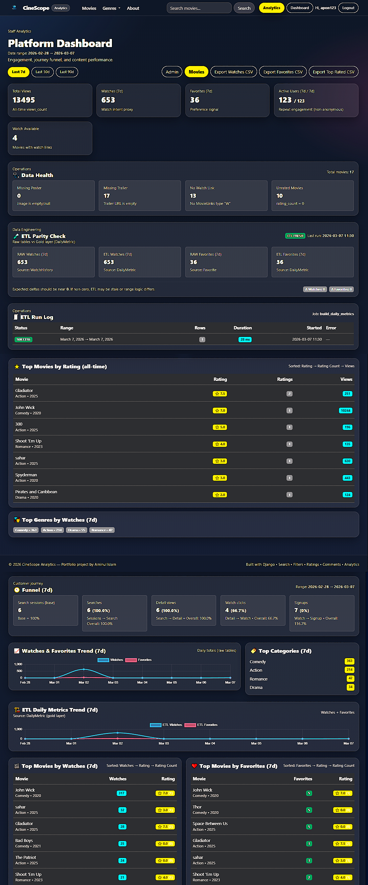

# CineScope Analytics — Movie Discovery + Product Analytics + Mini ETL (Django)

A **SaaS-style movie discovery platform** built with **Django** that combines a polished user experience (search, filters, ratings, comments) with a **staff-only analytics dashboard** and a **Data Engineering mini-pipeline**:

**raw events → ETL (DailyMetric “gold layer”) → dashboard + exports + ETL run log**

This project is designed to demonstrate end-to-end delivery for **Data Analyst / Analytics Engineer / Junior Data Engineer** roles — not just a CRUD website.

---

## Recruiter TL;DR (60 seconds)

- **User product**: movie catalog + smart search/filters + watch availability cues
- **Engagement signals**: event tracking + watch history + favorites + per-user ratings + comments
- **Analytics**: staff-only dashboard with KPIs, funnel, top tables, data quality panel
- **Data Engineering proof**: ETL command creates **DailyMetric gold table** + **ETLRunLog observability**
- **Exports**: CSV exports for enterprise-style reporting workflows

---

## Screenshots

## Screenshots

Screenshots are stored in `images/`.

## Screenshots

| Home                                            | Movie Detail |
|-------------------------------------------------|-------------|
|  |  |

| Analytics Dashboard | About |
|---------------------|-------|
|  |  |


- **Full walkthrough**  
  
---

## Why this project is hiring-relevant

### ✅ Data Analyst / BI
- KPI-driven dashboard: watches, favorites, active users, top categories/genres/movies
- Funnel metrics (search → detail → watch → signup) for product decision-making
- CSV exports for reporting workflows

### ✅ Analytics Engineer / Junior Data Engineer
- Event tracking + fact-style data capture
- **ETL job (management command)** builds daily aggregates into `DailyMetric` (gold table)
- **ETL observability**: run logs (success/fail, duration, rows updated) shown in the dashboard
- “Raw vs ETL” trend chart comparison (operational analytics pattern)

### ✅ Data Scientist (supporting)
- Produces clean, structured signals and aggregates suitable for future ML features (recommendation, ranking, cohorting)
- Not positioned as an ML-heavy project (no fake claims)

---

## Key Features

### 🎬 Movie Discovery (User-facing)
- Modern home page with hero slider + curated sections
- Movie catalog with:
  - Keyword search across **title, cast, description, genre**
  - Filters: **category, year, genre, max duration, watch availability**
  - **Smart ordering**: top-rated first when filtering/searching
- Movie detail page:
  - Trailer embed
  - Watch/download links
  - Related + recommended content

### ⭐ Ratings + 💬 Comments
- **Per-user rating**: one rating per user per movie; users can update
- Live rating updates (AJAX) across UI
- SaaS-style comment feed and comment form (moderation-ready)

### 📊 Staff Analytics Dashboard
- Date ranges: **7 / 30 / 90 days**
- KPIs:
  - Total views
  - Watches + favorites (range)
  - Active users (7d vs selected range)
  - Watch-available count
- Funnel (session-based):
  - Search → Detail → Watch → Signup
- Top tables:
  - Top movies by watches
  - Top movies by favorites
  - Top rated (all-time; rating + rating_count confidence)
- Data health panel:
  - Missing posters, missing trailers
  - No watch links
  - Unrated movies
- **CSV exports**:
  - Watches CSV, Favorites CSV, Top Rated CSV

### 🏗️ Data Engineering Mini-Pipeline (ETL)
- Management command: `build_daily_metrics`
- Builds daily aggregated metrics into `DailyMetric` (gold layer)
- Backfill support
- **ETLRunLog** stored in DB and displayed on analytics page (enterprise observability)

---

## Tech Stack
- **Python 3.11+**
- **Django 5.x**
- Bootstrap 5 (dark SaaS skin)
- Swiper.js (hero slider)
- Chart.js (analytics charts)
- SQLite (local dev)

---

## Project Structure (high level)

```text
cinescope-analytics/
└─ src/
   ├─ Imdb/            # Django project config (settings/urls/wsgi/asgi)
   ├─ movie/           # Main app (models, views, templates, analytics, ETL)
   ├─ static/          # Static assets (CSS/JS/images)
   ├─ templates/       # Global templates (base.html etc.) if used
   ├─ images/          # README screenshots (committed)
   ├─ media/           # Uploaded images (local dev only; gitignored)
   ├─ manage.py
   └─ requirements.txt