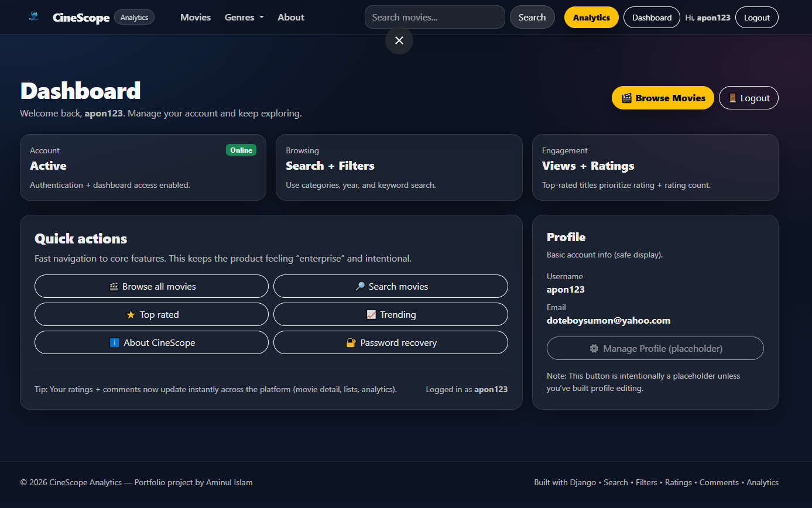

# CineScope Analytics

A Django data product that captures raw user engagement, runs a daily ETL pipeline into a gold-layer metrics table, and surfaces the results in a staff analytics dashboard — with KPI reporting, CSV exports, and pipeline observability built in.

**Raw events → ETL → Gold layer → Dashboard + Exports + Observability**

---

## Overview

CineScope is a data product, not a basic CRUD app. It captures raw user engagement signals, transforms them through an ETL pipeline into a gold-layer metrics table, and surfaces those results in a staff analytics dashboard with KPI reporting, CSV exports, and pipeline observability.

The project is structured around a pattern common in analytics engineering: raw activity data flows into a daily aggregation job, the job writes curated output into a `DailyMetric` table, and that table is consumed by a dashboard with filtering, ranked tables, and data health checks. Pipeline execution is logged in `ETLRunLog` with status, duration, row count, and error visibility.

---

## What This Demonstrates

### Data Analyst / Business Intelligence
- KPI dashboard driven by product activity data, with preset date ranges (7 / 30 / 90 days)
- Session-based funnel tracking: Search → Detail → Watch → Signup
- Confidence-weighted ranking for top-rated content (avoids naive average bias)
- Date-filtered CSV exports ready for use in reporting workflows
- Data quality checks surfaced inside the dashboard: missing posters, missing trailers, unrated titles

### Analytics Engineer / Junior Data Engineer
- `build_daily_metrics` ETL command reads from raw activity and engagement tables and writes aggregated daily records to a gold table (`DailyMetric`)
- `ETLRunLog` records each run's status, duration, row count, and any error output — queryable, not just logged to console
- Pipeline health is visible within the analytics interface itself
- Schema separates raw, intermediate, and gold layers — consistent with a medallion architecture pattern

---

## How to Review This Project

If you are short on time, the highest-signal areas are:

| What to look at | Where |
|---|---|
| ETL pipeline logic | `analytics/management/commands/build_daily_metrics.py` |
| Gold table + run log models | `analytics/models.py` |
| Dashboard view and KPI queries | `analytics/views.py` |
| Raw event capture | `events/models.py` |
| Confidence-weighted ranking | `analytics/views.py` → top-rated query |

Run `python manage.py build_daily_metrics` after seeding to see the pipeline execute and write to both `DailyMetric` and `ETLRunLog`.

---

## Features

### Movie Discovery
- Home page with hero section and curated content rows (recent, top-rated, most-watched)
- Full catalogue with keyword search across title, cast, description, and genre
- Filters for category, year, genre, duration, and watch availability
- Smart result ordering when filters are active: rating, rating count, views, recency
- Movie detail pages with trailer embed, watch/download links, and related content

### Ratings & Interaction
- Per-user rating model — one rating per movie per user, updatable
- Live AJAX rating updates across the UI
- Comment feed structure prepared for moderation workflows

### Staff Analytics Dashboard
- KPI cards: total views, watches in range, favourites in range, active users, watch-available count
- Session funnel: Search → Detail → Watch → Signup
- Top tables: movies by watches, movies by favourites, top-rated using confidence weighting
- Data quality checks: missing posters, missing trailers, no watch links, unrated movies
- CSV exports for watches, favourites, and top-rated movies
- Embedded ETL run log with status, duration, rows written, error messages, and timestamp

---

## Data Pipeline Architecture

```
Raw Layer                                Gold Layer        Observability
─────────────────────────────────        ──────────────    ─────────────────────
Event (search / detail / watch /                           ETLRunLog
  signup)                           ──▶  DailyMetric  ──▶  status, duration,
WatchHistory                             (daily aggs)      rows written, errors
Favourite
MovieRating
```

The `build_daily_metrics` management command is the core pipeline job. It aggregates the raw layer on a daily grain and upserts into `DailyMetric`. Each run appends a row to `ETLRunLog` regardless of outcome, so pipeline health is queryable.

---

## Tech Stack

- **Backend:** Django, Python
- **Database:** SQLite (development) — swap to PostgreSQL for production
- **Frontend:** Bootstrap, AJAX for live rating updates
- **Pipeline:** Django management command (`build_daily_metrics`)
- **Exports:** CSV via Django's `StreamingHttpResponse`

---

## Getting Started

**macOS / Linux**

```bash
git clone <repo-url>
cd cinescope
python3 -m venv .venv && source .venv/bin/activate
pip install -r requirements.txt
python manage.py migrate
python manage.py seed_data
python manage.py build_daily_metrics
python manage.py createsuperuser
python manage.py runserver
```

**Windows**

```bat
git clone <repo-url>
cd cinescope
python -m venv .venv
.venv\Scripts\activate
pip install -r requirements.txt
python manage.py migrate
python manage.py seed_data
python manage.py build_daily_metrics
python manage.py createsuperuser
python manage.py runserver
```

Open `http://127.0.0.1:8000/` for the discovery experience and `http://127.0.0.1:8000/dashboard/` for the analytics interface (staff login required).

---

## Project Structure

```
cinescope/
├── movies/          # Movie catalogue, ratings, watch history
├── analytics/       # DailyMetric model, ETL command, dashboard views
├── events/          # Raw event capture (search, detail, watch, signup)
├── templates/
└── static/
```

---

## Role Fit

This project was built to reflect the day-to-day work in analytics and data engineering roles — not to demonstrate web development ability. The focus is on the data layer: how events are captured, how they are aggregated, and how the results are made useful to a business user.

The stack is deliberately simple. Django is used as infrastructure, not the point. The point is the pipeline, the schema design, and the reporting layer — which maps directly to the work done in tools like dbt, Airflow, or a warehouse SQL layer in a professional environment.

If you are hiring for a role that involves building or maintaining data pipelines, writing analytical SQL, producing dashboards from activity data, or owning data quality — this project is intended to show that I can do that work from first principles.

---

## Screenshots


<table>
<tr>
<td width="50%" valign="top">

**Analytics Dashboard**


</td>
<td width="50%" rowspan="3" valign="top">

**Full Walkthrough**


</td>
</tr>
<tr>
<td valign="top">

**Movie Detail**


</td>
</tr>
<tr>
<td valign="top">

**About**


</td>
</tr>
</table>
